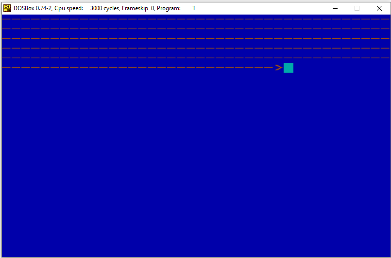

# Interrupts

This Program can be run on 32-bit computer architecture like DOS (Or using [DOSBox Emulator](https://www.dosbox.com/links.php)).
 Implementation of a new system screen saver : draw moving arrow on the screen.

## Program description:
-	**Textual Mode** - the program convert the screen to textual mode (the screen size is 25*40).
-	**Memory-mapped I/O method** - write to the screen was made by write to B800h memory segment.
-	**Interrupt 8** - each clock interrupt the arrow is moving on the screen.
-	**Change the PIT** - change Programmable Interval Timer value by using port 40h and port 43h (and channel 0).
-	**Cursor** - change the cursor size and position by using port 3D4h.
-	**Interrupt 9** - when the ESC key is pressed, the program is finish.

  

>Program in run mode.
 
